# 基于SSM的房屋租赁系统

#### 介绍
本房屋租赁系统旨在为用户、房东和管理人员提供一个高效、安全、便捷的租赁平台。系统通过信息化手段，简化租赁流程，提高管理效率，确保交易透明和信息真实。系统设有三种角色：管理端、用户端和房东端，各角色分别拥有不同的功能模块，以满足各自的需求和职责。

#### 技术栈介绍

后端技术栈：Springboot+Mysql+Maven

前端技术栈：Vue+Html+Css+Javascript+ElementUI

开发工具：Idea+Vscode+Navicate

#### 系统功能介绍

1. 管理端

管理端是系统的核心，负责平台的整体管理和维护，确保平台的正常运行和信息的真实性。管理端功能模块包括：

个人中心：管理员可以管理个人信息，修改密码等。

用户管理：管理和维护用户信息，包括注册用户的审核、信息修改等。

房主管理：管理房东信息，审核房东资格，维护房东档案。

房屋类型管理：维护不同类型的房屋信息，为房源分类提供基础。

房屋信息管理：管理平台上所有的房源信息，包括新增、修改、删除和审核房源信息。

预约看房管理：查看和管理用户的预约请求，安排看房时间。

合同信息管理：管理租赁合同信息，包括合同的创建、修改和存档。

房屋报修管理：处理用户和房东提交的报修请求，记录报修情况。

维修处理管理：安排维修人员处理报修问题，跟踪维修进度，确保及时处理。

房屋评价管理：管理用户对房屋和房东的评价信息，维护评价系统的公正性。

我要当房主管理：审核用户提交的房东申请，管理申请流程。

留言板管理：查看和管理用户和房东的留言和反馈，及时回应和处理问题。

2. 房东端

房东端为房东提供管理房源信息和处理租赁事务的功能。房东端功能模块包括：

个人中心：房东可以管理个人信息，修改密码，查看和编辑个人档案。

房屋信息管理：房东可以添加、修改、删除自己的房源信息，上传房源照片，设置租金和租期等。

预约看房管理：查看用户的预约请求，安排看房时间，与用户进行沟通。

合同信息管理：管理与租客签订的租赁合同，查看合同详细信息。

房屋报修管理：处理租客提交的报修请求，记录报修情况，安排维修。

维修处理管理：跟踪维修进度，确保问题及时解决。

房屋评价管理：查看租客对房屋的评价，进行回复和处理，改进服务质量。

3. 用户端

用户端为租客提供寻找房源和管理租赁事务的功能。用户端功能模块包括：

房屋信息：浏览和搜索平台上的所有房源信息，可以根据位置、租金、房型等条件进行筛选，查看房源详细信息和照片。

我要当房主：提交成为房东的申请，填写相关信息，等待管理员审核。

公告信息：查看平台发布的各类公告信息，了解最新动态和通知。

留言反馈：提交反馈和留言，与平台和房东进行沟通。

个人中心：管理个人信息，修改密码，查看和编辑个人档案。

预约看房管理：提交看房预约请求，查看预约状态，与房东沟通安排看房时间。

合同信息管理：查看与房东签订的租赁合同，管理合同详细信息。

房屋报修管理：提交房屋报修请求，记录报修情况，跟踪报修进度。

维修处理管理：查看维修进度，确保问题及时解决。

房屋评价管理：对租住的房屋和房东进行评价，提供反馈，帮助其他租客选择房源。

我的收藏管理：用户可以收藏感兴趣的房源，方便后续查看和比较，做出最佳租房决策。

平台作用

对用户的作用

便捷的租房信息获取：用户可以通过平台轻松浏览、筛选和查询房源信息，节省时间和精力。

安全的租房交易：平台通过严格的信息审核机制，确保房源信息的真实性，降低租房风险。

高效的订单管理：用户可以在线提交和管理租房订单，实时跟踪订单状态，提升租房效率。

个性化的收藏功能：用户可以收藏感兴趣的房源，方便后续查看和比较，做出最佳租房决策。

对房东的作用

高效的房源管理：房东可以通过平台方便地管理房源信息，实时更新房源状态，提升管理效率。

扩大房源曝光：平台聚集了大量租客，房东可以通过平台快速找到合适的租客，减少房源空置时间。

便捷的订单处理：房东可以在线查看和管理租客的订单请求，及时处理订单相关事务，提升服务质量。

安全的交易保障：平台提供的信息审核和纠纷处理机制，保障房东的合法权益。

#### 系统功能截图

代码结构

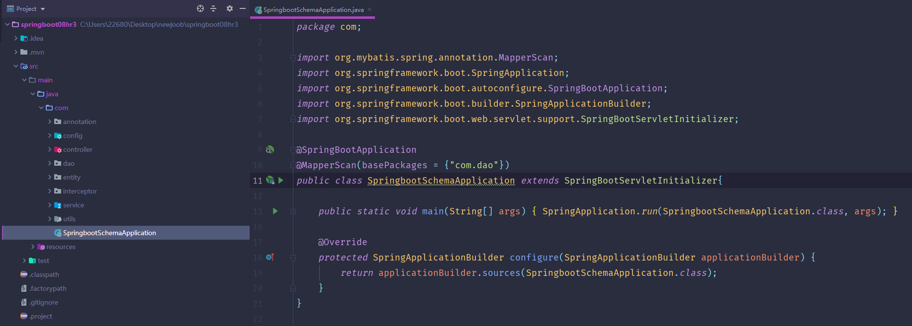

数据库表

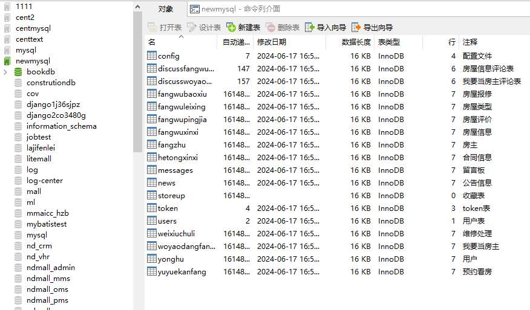

登录

一、房主端

个人中心

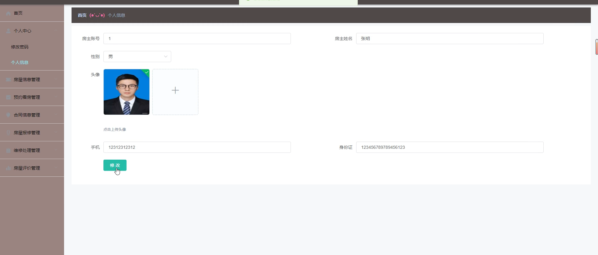

合同信息管理

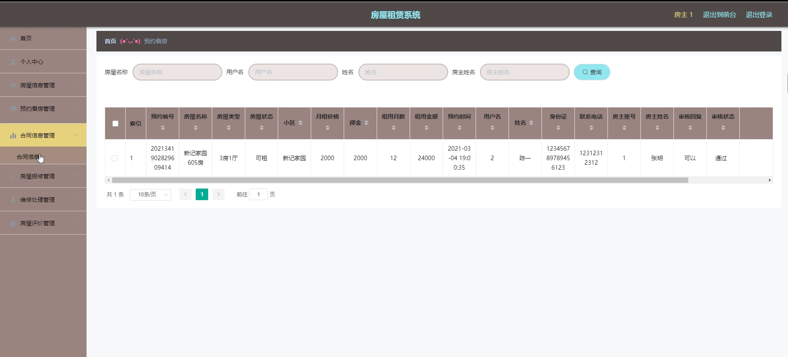

二、管理员端

用户管理

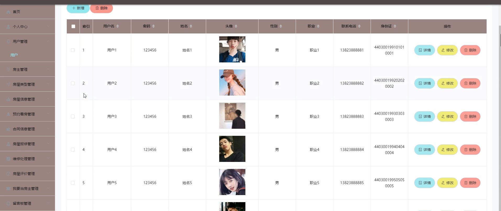

房主管理

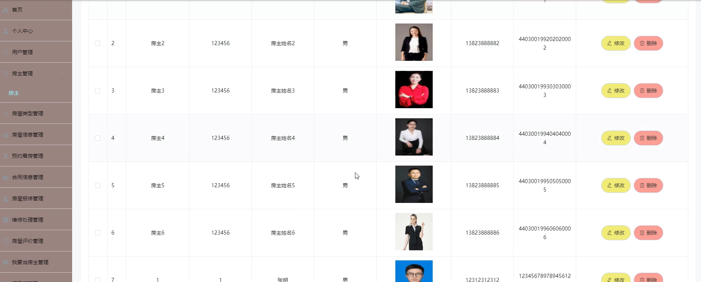

房屋类型管理

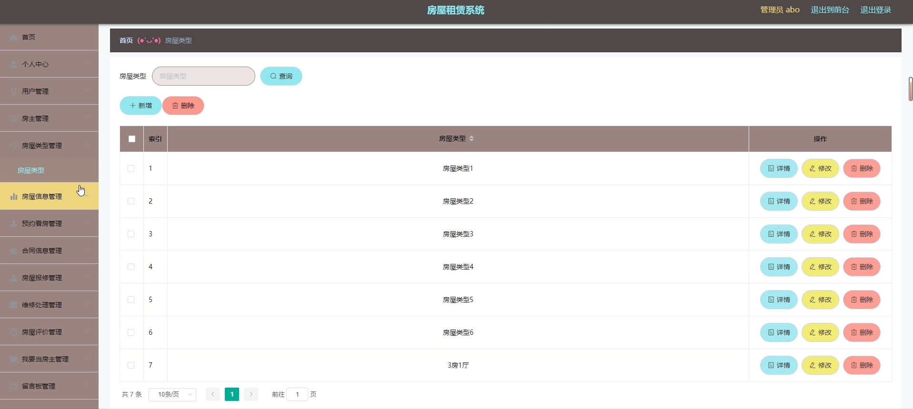

房屋信息管理

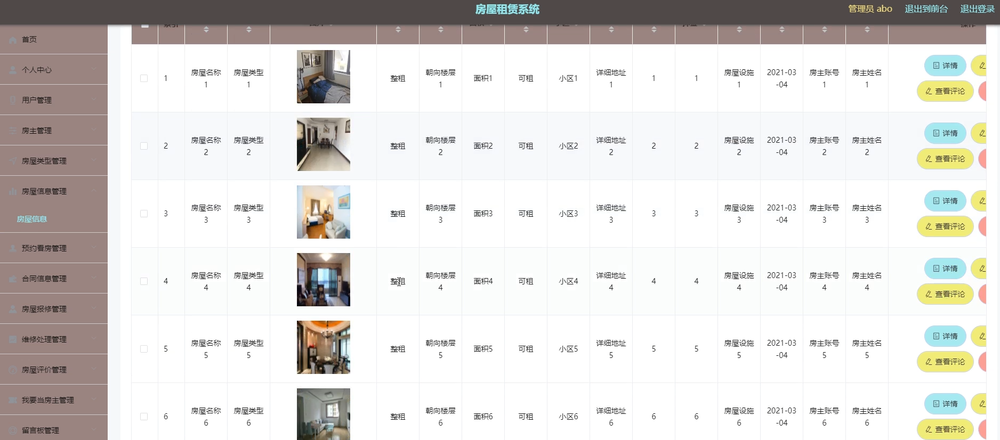

三、用户端

首页

房屋信息

我要当房主

留言反馈

预约看房管理

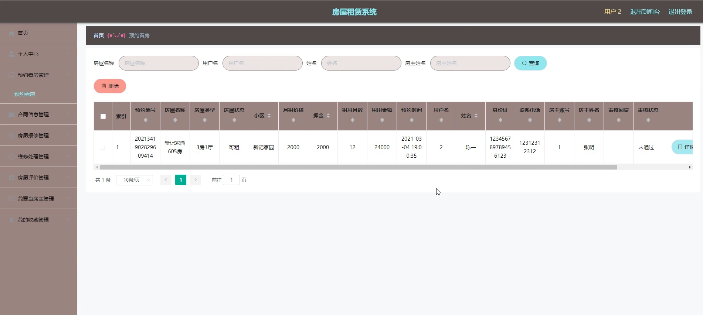

我的收藏管理

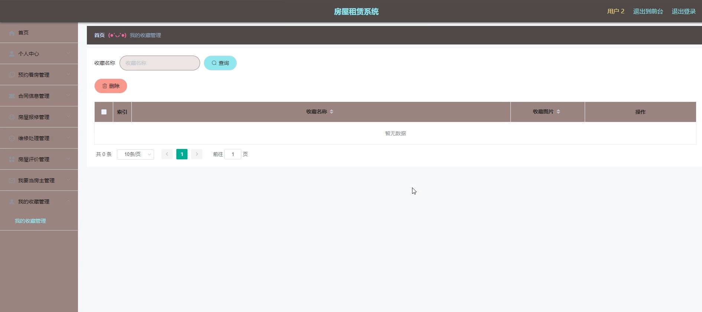

合同信息管理

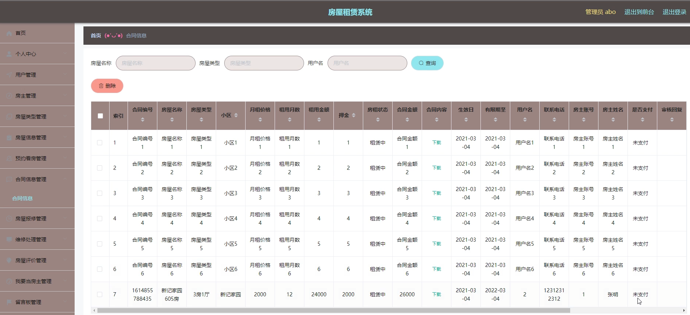

房屋报修管理

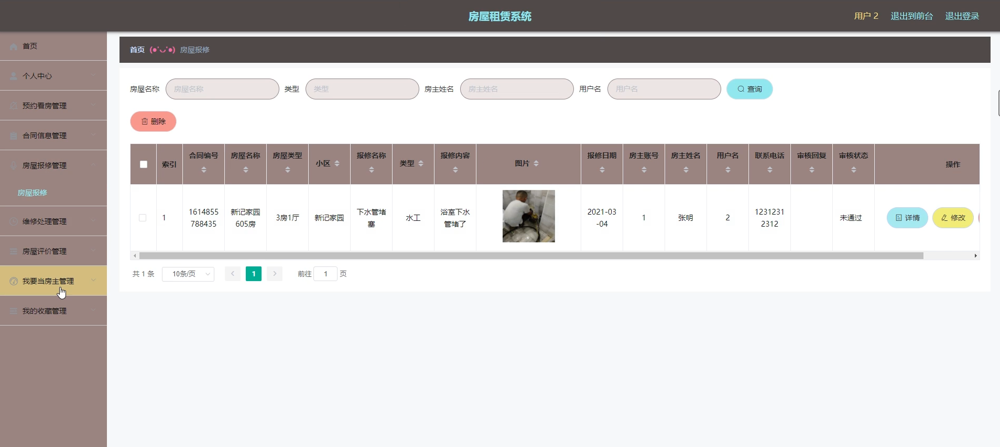

#### 总结

房屋租赁系统通过现代化的技术手段，为用户、房东和管理人员提供了一个便捷、安全、高效的租赁平台。系统不仅提升了租赁过程的效率，还通过信息化的管理和操作，实现了租赁过程的透明化和标准化，确保了交易的公平性和安全性。平台的建立不仅为用户和房东带来了极大的便利和保障，同时也促进了租赁市场的健康发展，为房屋租赁行业带来了新的机遇和挑战。

#### 使用说明

创建数据库，执行数据库脚本 修改jdbc数据库连接参数 下载安装maven依赖jar 启动idea中的springboot项目

后台地址：http://localhost:8080/springboot08hr3/admin/dist/index.html

管理员  abo 密码 abo

前台地址：http://localhost:8080/springboot08hr3/front/index.html

